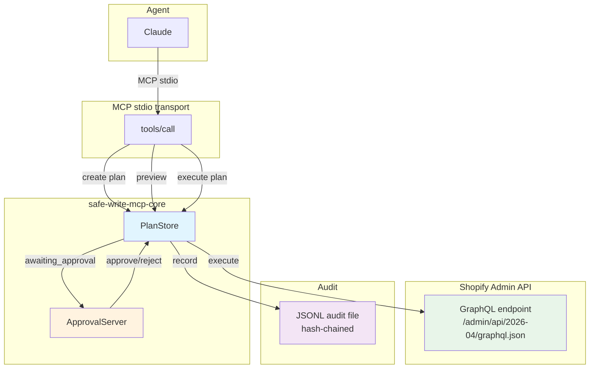

# Safe-write MCP server for Shopify Admin API operations

An agent can read and modify a Shopify store without being able to cause an unrecoverable accident. The safety layer is the differentiator: every write previews before it commits, large or irreversible changes require out-of-band human approval, and every action is recorded to a tamper-evident hash-chained audit file.

## Architecture



**The two-phase pattern** (preview → token → execute) is the core discipline. Every write tool:

1. **Preview** — reads current state and computes what would change, performing zero mutation calls
2. **Token** — issues a plan token bound to the exact previewed manifest via a SHA-256 fingerprint
3. **Approval** — plans exceeding `approvalRequiredAboveItems` (default 25) or containing always-gated operations wait for human approval at `http://127.0.0.1:4319/`
4. **Execute** — re-reads current values, refuses if they drifted from the preview (`STATE_CHANGED`), then applies mutations per-item with a full success/failure ledger

A plan whose manifest exceeds `hardMaxItems` (default 250) is refused outright — no token, no approval path.

**Irreversible operations** (`cancel_order`, `refund_order`) always require approval regardless of item count and cannot be rolled back. Reversible operations (price changes, inventory adjustments) support rollback within a configurable window (default 24 hours).

## Threat model

The risk is **not** a malicious agent — the agent is trusted to author correct GraphQL. The risk is a **trusted-but-fallible** agent: syntactically perfect, well-formed operations whose *scope* is the problem.

**The killer scenario** — a syntactically perfect bulk reprice with a misplaced decimal:

```
update_prices([...], newPrice: 1.5)   ← meant 15.00, typed 1.5
```

A 500-product bulk update that runs without preview-and-approve, or where the agent's price calculation contains a typo, produces exactly the wrong result at scale. Approval would catch it: a human sees "change 500 prices from $X to $1.50" and flags the不对劲. Without approval, or without the preview that makes the damage visible *before* it happens, the error lands silently in Shopify.

Three mechanisms carry the safety guarantee:

**1. Preview-first, computed-diff.** Every write tool reads current state and computes the manifest (`{ref, before, after}` pairs) without calling any mutation. A `STATE_CHANGED` re-read at execute time refuses the write if the world moved since preview. The blast radius is visible *before* anything changes.

**2. Approval gating above the threshold.** Plans touching `>= approvalRequiredAboveItems` items (default 25) require human approval. The threshold is sized for "is this large enough to warrant a human eye?" — meaningful for bulk value changes; irrelevant for one-item operations (which get unconditional approval for irreversible ops instead).

**3. Plan token bound to exact manifest.** The token is a SHA-256 fingerprint of the exact previewed manifest — not an opaque ID. Swapping in a wider set of items or a different price at execute time produces a different fingerprint and is refused as `STATEMENT_MISMATCH`.

Rollback provides recovery for reversible mistakes (wrong price, wrong inventory level) within the rollback window. It does *not* recover from the irreversible operations: a cancelled order stays cancelled, a refunded payment stays refunded.

## Quick start

```bash
npm install
npm test
npm run build
```

Set the required environment variable and point Claude Desktop at the server (see Configuration below). `node dist/index.js` starts the [localhost approval UI](#localhost-approval-ui) alongside the MCP stdio server.

## Configuration

Configuration file (default `config.json` in the working directory, or path via `SHOPIFY_CONFIG`):

```json
{
  "shopify": {
    "storeDomain": "my-store.myshopify.com",
    "apiVersion": "2026-04"
  },
  "plans": {
    "planTtlMs": 60000,
    "approvalRequiredAboveItems": 25,
    "hardMaxItems": 250,
    "maxPriceChangePct": 30,
    "rollbackTtlMs": 86400000
  },
  "approvalServer": {
    "enabled": true,
    "port": 4319
  },
  "protectedTags": ["do-not-touch"],
  "callerId": "shopify-operations-mcp"
}
```

### Config reference

| Field | Type | Default | Description |
|---|---|---|---|
| `shopify.storeDomain` | `string` | *(required)* | MyShopify domain, e.g. `"my-store.myshopify.com"` |
| `shopify.apiVersion` | `string` | `"2026-04"` | Pinned quarterly Admin API version |
| `shopify.adminToken` | `string` | *(env only)* | Admin API token — **never in config file**, only `SHOPIFY_ADMIN_TOKEN` env var |
| `plans.planTtlMs` | `positive int` | `60000` | How long a plan token stays valid (ms). Overridable: `SHOPIFY_PLAN_TTL_MS` |
| `plans.approvalRequiredAboveItems` | `positive int` | `25` | Plans touching this many items require human approval. Overridable: `SHOPIFY_APPROVAL_REQUIRED_ABOVE_ITEMS` |
| `plans.hardMaxItems` | `positive int` | `250` | Plans exceeding this item count are refused outright. Overridable: `SHOPIFY_HARD_MAX_ITEMS` |
| `plans.maxPriceChangePct` | `positive int` | `30` | Price changes exceeding this % require approval. Overridable: `SHOPIFY_MAX_PRICE_CHANGE_PCT` |
| `plans.rollbackTtlMs` | `positive int` | `86400000` | Rollback window (ms, default 24h). Overridable: `SHOPIFY_ROLLBACK_TTL_MS` |
| `approvalServer.enabled` | `boolean` | `true` | Start localhost approval UI alongside MCP server. Overridable: `SHOPIFY_APPROVAL_SERVER_ENABLED` |
| `approvalServer.port` | `positive int` | `4319` | Port for localhost approval UI (127.0.0.1 only). Overridable: `SHOPIFY_APPROVAL_SERVER_PORT` |
| `protectedTags` | `string[]` | `["do-not-touch"]` | Tags that plans may never modify. Overridable: `SHOPIFY_PROTECTED_TAGS` (comma-separated) |
| `callerId` | `string` | `"unknown"` | Identity recorded on every audit row. Overridable: `SHOPIFY_CALLER_ID` |

**Invariant:** `plans.hardMaxItems` must be `>= plans.approvalRequiredAboveItems`. The loader throws if violated.

### Environment variables

All config fields are overridable by environment variables (precedence: env > config file > default). `SHOPIFY_ADMIN_TOKEN` is **required** and only ever read from the environment.

## Tools

### Read tools

#### `search_products`

Search products by title, SKU, vendor, or tag. Returns products with variants, current prices, and per-location inventory levels.

**Arguments:**

| Field | Type | Description |
|---|---|---|
| `title` | `string?` | Matches products whose title contains the term (Shopify fuzzy search) |
| `sku` | `string?` | Matches products with a variant whose SKU equals the term |
| `vendor` | `string?` | Matches products from this vendor |
| `tag` | `string?` | Matches products carrying this tag |
| `first` | `positive int?` | Page size passed to Admin API (default 50) |

**Returns:** `products[]` with `id`, `title`, `vendor`, `tags`, `variants` (each with `id`, `sku`, `price`, `inventoryItemId`, `inventoryLevels`), plus `flags.protected` / `flags.protectedTags` indicating whether the product carries a protected tag.

**Safety properties:** Pure read — zero mutation calls. Protected-tagged products are returned (never filtered out) so a later write plan that touches them is refused.

#### `list_orders`

List orders filtered by financial status, fulfillment status, and date range.

**Arguments:**

| Field | Type | Description |
|---|---|---|
| `financialStatus` | `FinancialStatus?` | `"pending" \| "authorized" \| "partially_paid" \| "paid" \| "partially_refunded" \| "refunded" \| "voided"` |
| `fulfillmentStatus` | `FulfillmentStatus?` | `"fulfilled" \| "partial" \| "unfulfilled"` |
| `createdAfter` | `ISO-8601 string?` | Orders created at or after this datetime |
| `createdBefore` | `ISO-8601 string?` | Orders created at or before this datetime |
| `first` | `positive int?` | Page size (default 250) |

**Returns:** `orders[]` with `id`, `name`, `financialStatus`, `fulfillmentStatus`, `totalPrice`, `lineItems[]`.

**Safety properties:** Pure read — zero mutation calls.

### Write tools (two-phase)

All write tools go through **preview → token → (approval) → execute**.

#### `update_inventory`

Set absolute inventory quantities at a named location for multiple inventory items. Preview reads current levels; execute calls `inventorySetQuantities`.

**Arguments:**

| Field | Type | Description |
|---|---|---|
| `locationId` | `string` | `gid://shopify/Location/…` id |
| `adjustments` | `InventoryAdjustment[]` | Each `{inventoryItemId, quantity}` sets the available quantity at `locationId` |

**Safety properties:**
- Threshold gating: requires approval when `adjustments.length >= approvalRequiredAboveItems` (default 25); refused outright when `> hardMaxItems` (default 250)
- Protected-tag enforcement: plans touching a product with a protected tag throw `PROTECTED_RESOURCE` before a token is issued — no approval path
- Per-item ledger: partial failure is recorded, never hidden
- Rollback: supported — restores `before.available` quantities via the snapshot

#### `cancel_order`

Cancel a Shopify order. **Always requires approval** regardless of item count. **Cannot be rolled back.**

**Arguments:**

| Field | Type | Description |
|---|---|---|
| `orderId` | `string` | `gid://shopify/Order/…` id |
| `reason` | `string` | `"customer" \| "inventory" \| "fraud" \| "other"` |
| `restock` | `boolean` | Return items to inventory |
| `notifyCustomer` | `boolean` | Send cancellation email |

**Safety properties:**
- **Always approval**: `alwaysRequireApproval: true` is hardcoded in the tool — approval thresholds are never consulted
- **No snapshot**: no `snapshotStore.capture()` call — rollback is not opened for this operation
- **Rollback**: refused with `ROLLBACK_UNSUPPORTED` — cancellation is a state transition, not a value change

#### `refund_order`

Refund a Shopify order. **Always requires approval** regardless of item count. **Cannot be rolled back.**

**Arguments:**

| Field | Type | Description |
|---|---|---|
| `orderId` | `string` | `gid://shopify/Order/…` id |
| `refundLineItems` | `RefundLineItem[]?` | Line items and quantities to refund; absent = full refund of all fulfilled items |
| `reason` | `string` | Human-readable reason recorded in audit |

Each `RefundLineItem`: `{lineItemId, quantity, restockType?}` where `restockType` is `"RETURN" \| "NO_RESTOCK" \| "CANCEL"`.

**Safety properties:**
- **Always approval**: `alwaysRequireApproval: true` hardcoded in the tool
- **Preview via `refundCalculate`**: zero-write GraphQL call returns exact suggested refund amounts for the approval surface
- **No snapshot**: no rollback support
- **PII-free audit**: only order ID and refund amount are recorded; customer name/email are never in the audit trail

#### `rollback_plan`

Undo an executed reversible plan within the rollback window (default 24 hours).

**Arguments:**

| Field | Type | Description |
|---|---|---|
| `planToken` | `string` | The token from the executed plan to roll back |

**Safety properties:**
- No approval required: restoring the prior state is the safe direction
- Window guard: `ROLLBACK_WINDOW_EXPIRED` when the snapshot has expired or the plan was never previewed
- Kind guard: `ROLLBACK_UNSUPPORTED` when the plan kind is `cancel_order` or `refund_order`
- Inverse mutations only on refs that *succeeded* at execute time — a ref that failed is left untouched
- Per-item ledger: partial rollback failure is recorded honestly

### Plan lifecycle

```
Agent calls preview tool
       │
       ▼
  Manifest built
  (pure reads, zero writes)
       │
       ▼
  Item count checked
       │
       ├─── <= hardMaxItems ──► token issued
       │                         │
       │                    >= approvalRequiredAboveItems
       │                         │     or alwaysRequireApproval
       │                         ▼
       │              status: "awaiting_approval"
       │                         │
       │                    human approves
       │                         │
       ▼                         │
  HARD_MAX_ITEMS_EXCEEDED         │
  (no token, refused)            ▼
                           execute_plan
                                │
                           STATE_CHANGED check
                           (re-read, compare digest)
                                │
                           ┌────┴────┐
                        success   failure
                           │         │
                      per-item   per-item
                      ledger     ledger
                           │
                      snapshot stored
                      for rollback
```

## Localhost approval UI

A plain-HTML page for a human to approve or reject plans above the threshold. Runs as its own local-only HTTP server, started alongside the MCP server.

- **Access:** `http://127.0.0.1:4319/` (or configured `approvalServer.port`) on the machine running the server. Unreachable from other machines.
- **API:** `GET /api/plans` returns pending plans as JSON; `POST /api/plans/:token/approve` and `POST /api/plans/:token/reject` handle approval.
- **Security boundary:** approval/rejection is **never** exposed as an MCP tool — the agent cannot approve its own plans.

## Audit log

Every preview, approval, execution, rejection, and refusal writes one JSON object to the audit file:

```json
{"seq":1,"prev_hash":"0000...","hash":"ab12...","ts":1734567890000,"tool":"update_inventory","reason":"adjusting stock","planToken":"abc123","status":"executed","previewCount":10,"callerId":"shopify-ops","durationMs":234,"detail":"all 10 item(s) executed"}
```

- `seq` — monotonically increasing per-file sequence
- `prev_hash` — SHA-256 of the previous row (genesis = 64 zero chars)
- `hash` — SHA-256 of this row (excluding the `hash` field itself)
- **Tamper-evident, not tamper-proof:** editing, reordering, or deleting a non-terminal row breaks the chain at that row. Suffix truncation or replacing the whole file with a valid chain is *not* detectable from the file alone.
- **PII defense-in-depth:** top-level keys matching `/customerEmail|customerName/i` are stripped before hashing. Free-text `reason`/`detail` strings are not scanned — hosts must sanitize those before calling `record()`.
- **Restart safety:** on open, the sink verifies the existing chain and resumes `seq`/`prev_hash` from the last line.

Verify the chain with `scripts/verify-audit.ts`.

## Dev-store seeder

`scripts/seed-store.ts` generates a realistic store to point the server at — deterministic, like sw-postgres-mcp's seeder. Everything is derived from a seeded PRNG (mulberry32), so two runs with the same seed produce identical data and identical counts.

**Run it:**

```bash
SHOPIFY_STORE_DOMAIN=my-dev.myshopify.com SHOPIFY_ADMIN_TOKEN=shpat_... npm run seed -- --seed 42
```

The seeder reuses the server's `loadConfig`, so `SHOPIFY_STORE_DOMAIN` / `SHOPIFY_ADMIN_TOKEN` / `SHOPIFY_API_VERSION` (and any config file) are honored exactly as for the server; `--seed` defaults to `42`. Flags:

- `--seed <number>` — PRNG seed; default `42`. Any two runs with the same seed are identical.
- `--dry-run` — prints the plan counts and verifies the sizing invariants without making any API call (no credentials needed).
- `--order-delay-ms <ms>` — sleep between order creates. Development stores cap `orderCreate` at five per minute, so plan ~24 minutes for the 120 orders; default is no delay.

**Data shape (seed 42):**

| Resource | Count | Notes |
|---|---|---|
| Products | 300 | titled `Seeded Product 1…300`, spread across 8 vendors and 8 product types |
| Variants | 768 | 1–4 per product, SKUs `SEED-<product>-<variant>`, prices $5–$300 |
| Locations | 2 | the first two locations in the store (locations are physical, not created) |
| Customers | 20 | `seed-customer-N@example.com` |
| Orders | 120 | Bogus-Gateway test orders (`test: true`, inventory bypassed) |

Order-state mix: 116 paid / 4 pending; 40 fulfilled / 80 unfulfilled; 12 carry a fixed-amount discount code. Every product, customer, and order is tagged `seeded-store`.

**Sizing invariants** (asserted against the loaded config before any API call — the seeder fails fast if they don't hold):

- The full variant set (768) exceeds `hardMaxItems` (default 250), so a store-wide reprice is **refused** (`HARD_MAX_ITEMS_EXCEEDED`).
- The `sale` tag covers 156 variants — between `approvalRequiredAboveItems` (default 25) and `hardMaxItems` (250) — so a reprice scoped to `tag:'sale'` **requests approval** but is not refused.

The structural sizing is seed-independent: every 5th product (60 of 300) carries `sale`, and each product has 1–4 variants, so the `sale` tag always covers between 60 and 240 variants.

**Idempotency:** a re-run first **wipes** every previously-seeded order, customer, and product tagged `seeded-store` (orders first — customers can only be deleted once their orders are gone), then regenerates. Products delete their variants and inventory items with them; the two locations are reused, never deleted. The script prints counts at the end so you can diff two runs.

## Live integration suite

`tests/integration/` is a **manual-only, env-gated** suite that proves the server against the real Admin API and the seeded dev store. It is deliberately kept out of CI: it needs real store credentials (secrets must never reach CI) and it makes rate-limited calls that would flake.

**Run it:**

```bash
SHOPIFY_STORE_DOMAIN=my-dev.myshopify.com SHOPIFY_ADMIN_TOKEN=shpat_... npm run seed -- --seed 42
SHOPIFY_STORE_DOMAIN=my-dev.myshopify.com SHOPIFY_ADMIN_TOKEN=shpat_... npm run test:integration
```

Re-seed before each run so the destructive tests find fresh candidate orders. With **no credentials**, the whole suite skips itself with a console note and exits 0 — `npm run test:integration` and the default `npm test` both pass as a no-op, and **it never runs on CI**.

**What it covers** (each file is `describe.skip`-gated unless `SHOPIFY_STORE_DOMAIN` **and** `SHOPIFY_ADMIN_TOKEN` are set):

| File | Proves |
|---|---|
| `readTools.test.ts` | `search_products` by vendor/tag/sku/title, first-page pagination, protected-tag flags (seeded products are all unprotected); `list_orders` financial/fulfillment filters. Product counts are exact seed-42 constants; order counts are tolerant bands (this suite's own destructive tests consume them) |
| `updatePrices.test.ts` | `update_prices` two-phase against real variants: preview → execute a small change → verify → roll back via `rollback_plan` → verify restored |
| `updateInventory.test.ts` | `update_inventory` two-phase against a real inventory item + location: preview → execute a +1 change → verify → roll back → verify restored |
| `createDiscount.test.ts` | `create_discount` two-phase: preview → create → verify active → deactivate via rollback |
| `cancelRefund.test.ts` | **DESTRUCTIVE** — exactly one real `cancel_order` and one real `refund_order`, preview → approve → execute, against paid/unfulfilled seeded orders discovered at runtime, asserting the audit-consistent success ledger |
| `throttle.test.ts` | Cost-aware throttling: a parallel burst exceeding the API cost budget is absorbed by the default client (backoff); a no-retry client surfaces `ShopifyApiError` `SHOPIFY_THROTTLED` instead of an unknown error |

Files run serially (`fileParallelism: false`) because the suite shares one mutable store — destructive writes must never race the read counts. Config: `vitest.integration.config.ts`.

## Limitations

Stated plainly, not hidden:

- **Order cancels/refunds are irreversible.** Approval protects them — it does not enable rollback. A cancelled order cannot be uncancelled; a refunded payment cannot be unwired. RollbackPlan refuses `cancel_order` and `refund_order` tokens with `ROLLBACK_UNSUPPORTED`.

- **Rollback is best-effort snapshot restoration.** The snapshot captures the before-state at preview time; it is only usable as an inverse-mutation target while the world hasn't changed. After `rollbackTtlMs` (default 24h), rollback is refused with `ROLLBACK_WINDOW_EXPIRED`. Rollback restores values, not external side effects (e.g., a refund notification already sent).

- **Partial failure leaves a per-item ledger, not an exception.** When a batch mutation fails for some items and succeeds for others, the executor records each outcome honestly. There is no all-or-nothing rollback across items — only per-item inverse mutations at rollback time for the items that succeeded.

- **Plan state is in-memory and process-scoped.** The PlanStore and SnapshotStore hold all pending and executed plan state in process memory. A server restart loses every pending plan (re-preview required) and every rollback window. The audit log is the durable record of what happened.

- **Single store, no multi-tenancy.** One server process talks to one Shopify store. Running for multiple stores means running multiple server instances with separate credentials and audit files.

- **No per-user auth.** `callerId` identifies the deployment (default `"unknown"`), not an individual person. There is no per-MCP-session or per-user authentication in v1. Anyone who can reach the server's stdio transport (or `127.0.0.1:4319` for approvals) can use it with the configured store credentials.

- **`STATE_CHANGED` is a pre-write drift check, not a universal compare-and-swap.** The re-read catches drift that exists *before* the mutation is sent. It does not close the window between re-read and write. Shopify exposes provider-level compare-and-swap for some operations (e.g. `changeFromQuantity` for inventory) but not all (plain price updates are last-write-wins).

## License

[MIT](./LICENSE)
